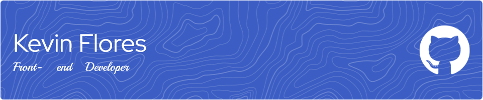

 

# 💫 About Me:
Hello there! 👋 Welcome to my humble GitHub profile. I am a young developer passionate about programming and technology in general.  🧑🏽‍💻 I'm currently a simple university student, but in my spare time I dedicate myself to improving my programming skills and logic. 🌱 At this moment I am reinforcing my skills for the back-end. 💼 I'm also working on a Laravel project together with a small development group. 🫱🏼‍🫲🏼 I'm a bit shy, but I get along well with people, especially when it comes to collaborating and helping solve problems. 🛠️ I specialize in web programming, more specifically in the UI/UX section and front-end in general. 🎯 I plan to continue improving and accumulate achievements to get a job as a front-end developer.

## 🌐 Socials:

 

# 💻 Tech Stack:

## 📝 Languages

    
    
    
    
    
    

 

## 🛠️ Frameworks & Libraries

    
    
    

 

## 💾 Databases

    
    

 

## 🖼️Design

    
    
    

 

## 📃 Others

    
    
    

 

# 📊 GitHub Stats:

 

    <picture>
        <source 
            srcset="https://github-readme-stats.vercel.app/api?username=KevinFlores26&theme=dark&hide_border=true&include_all_commits=true&count_private=false&rank_icon=github&show_icons=true&card_width=330px" 
            media="(prefers-color-scheme: dark)"
        />
        <source 
            srcset="https://github-readme-stats.vercel.app/api?username=KevinFlores26&hide_border=true&include_all_commits=true&count_private=false&rank_icon=github&show_icons=true&card_width=330px" 
            media="(prefers-color-scheme: light), (prefers-color-scheme: no-preference)"
        />
        
    </picture>
    <picture>
        <source 
            srcset="https://github-readme-streak-stats.herokuapp.com/?user=KevinFlores26&theme=dark&hide_border=true" 
            media="(prefers-color-scheme: dark)"
        />
        <source 
            srcset="https://github-readme-streak-stats.herokuapp.com/?user=KevinFlores26&hide_border=true" 
            media="(prefers-color-scheme: light), (prefers-color-scheme: no-preference)"
        />
        
    </picture> 
    <picture>
        <source 
            srcset="https://github-readme-stats.vercel.app/api/top-langs/?username=KevinFlores26&theme=dark&hide_border=true&include_all_commits=true&count_private=false&layout=normal&bg_color=00000000" 
            media="(prefers-color-scheme: dark)"
        />
        <source 
            srcset="https://github-readme-stats.vercel.app/api/top-langs/?username=KevinFlores26&hide_border=true&include_all_commits=true&count_private=false&layout=donut-vertical&bg_color=00000000" 
            media="(prefers-color-scheme: light), (prefers-color-scheme: no-preference)"
        />
        
    </picture>

<!--
    <a  href="https://icons8.com/icon/xuvGCOXi8Wyg/linkedin">LinkedIn</a> icon by <a href="https://icons8.com">Icons8</a>
-->
